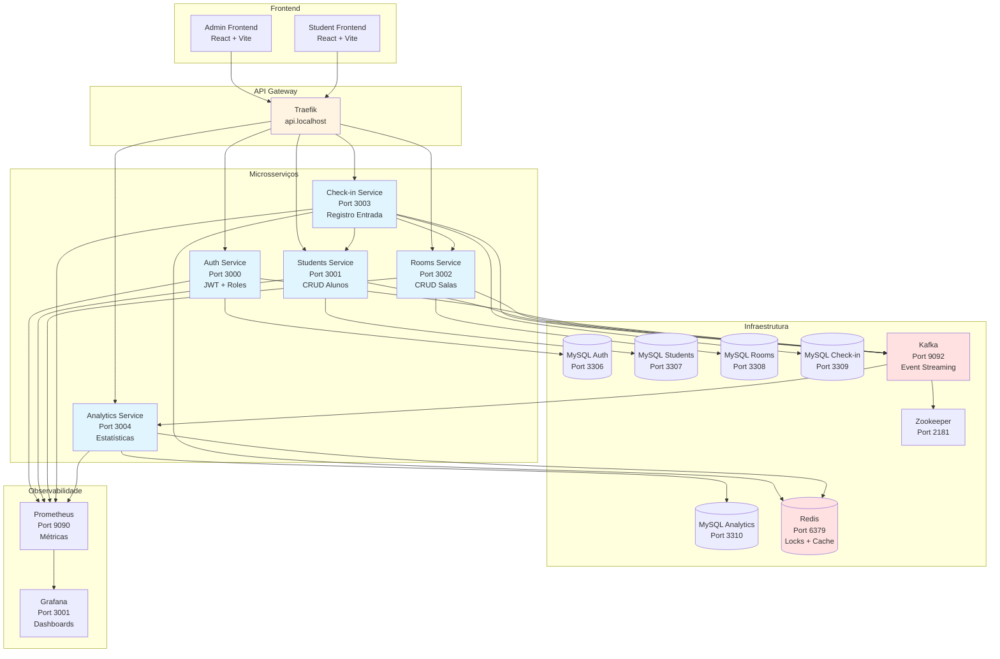

# 1. Arquitetura Geral do Sistema

```mermaid
graph TB
    subgraph "Frontend"
        Admin[Admin Frontend<br/>React + Vite]
        Student[Student Frontend<br/>React + Vite]
    end

    subgraph "API Gateway"
        Traefik[Traefik<br/>api.localhost]
    end

    subgraph "Microsserviços"
        Auth[Auth Service<br/>Port 3000<br/>JWT + Roles]
        Students[Students Service<br/>Port 3001<br/>CRUD Alunos]
        Rooms[Rooms Service<br/>Port 3002<br/>CRUD Salas]
        Checkin[Check-in Service<br/>Port 3003<br/>Registro Entrada]
        Analytics[Analytics Service<br/>Port 3004<br/>Estatísticas]
    end

    subgraph "Infraestrutura"
        MySQL1[(MySQL Auth<br/>Port 3306)]
        MySQL2[(MySQL Students<br/>Port 3307)]
        MySQL3[(MySQL Rooms<br/>Port 3308)]
        MySQL4[(MySQL Check-in<br/>Port 3309)]
        MySQL5[(MySQL Analytics<br/>Port 3310)]
        Redis[(Redis<br/>Port 6379<br/>Locks + Cache)]
        Kafka[Kafka<br/>Port 9092<br/>Event Streaming]
        ZK[Zookeeper<br/>Port 2181]
    end

    subgraph "Observabilidade"
        Prometheus[Prometheus<br/>Port 9090<br/>Métricas]
        Grafana[Grafana<br/>Port 3001<br/>Dashboards]
    end

    Admin --> Traefik
    Student --> Traefik
    Traefik --> Auth
    Traefik --> Students
    Traefik --> Rooms
    Traefik --> Checkin
    Traefik --> Analytics

    Auth --> MySQL1
    Students --> MySQL2
    Rooms --> MySQL3
    Checkin --> MySQL4
    Analytics --> MySQL5

    Checkin --> Students
    Checkin --> Rooms
    Checkin --> Redis
    Checkin --> Kafka

    Students --> Kafka
    Rooms --> Kafka
    Auth --> Kafka

    Kafka --> Analytics
    Analytics --> Redis

    Auth --> Prometheus
    Students --> Prometheus
    Rooms --> Prometheus
    Checkin --> Prometheus
    Analytics --> Prometheus

    Prometheus --> Grafana
    Kafka --> ZK

    style Auth fill:#e1f5ff
    style Students fill:#e1f5ff
    style Rooms fill:#e1f5ff
    style Checkin fill:#e1f5ff
    style Analytics fill:#e1f5ff
    style Traefik fill:#fff4e1
    style Redis fill:#ffe1e1
    style Kafka fill:#ffe1e1
```

