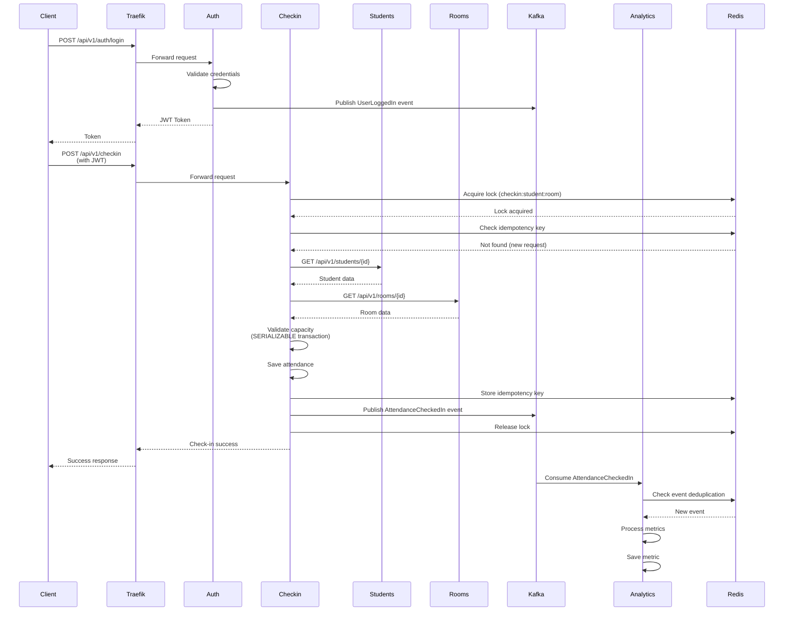

# 2. Fluxo de Comunicação entre Microsserviços

```mermaid
sequenceDiagram
    participant Client
    participant Traefik
    participant Auth
    participant Checkin
    participant Students
    participant Rooms
    participant Kafka
    participant Analytics
    participant Redis

    Client->>Traefik: POST /api/v1/auth/login
    Traefik->>Auth: Forward request
    Auth->>Auth: Validate credentials
    Auth->>Kafka: Publish UserLoggedIn event
    Auth-->>Traefik: JWT Token
    Traefik-->>Client: Token

    Client->>Traefik: POST /api/v1/checkin<br/>(with JWT)
    Traefik->>Checkin: Forward request
    Checkin->>Redis: Acquire lock (checkin:student:room)
    Redis-->>Checkin: Lock acquired
    Checkin->>Redis: Check idempotency key
    Redis-->>Checkin: Not found (new request)
    Checkin->>Students: GET /api/v1/students/{id}
    Students-->>Checkin: Student data
    Checkin->>Rooms: GET /api/v1/rooms/{id}
    Rooms-->>Checkin: Room data
    Checkin->>Checkin: Validate capacity<br/>(SERIALIZABLE transaction)
    Checkin->>Checkin: Save attendance
    Checkin->>Redis: Store idempotency key
    Checkin->>Kafka: Publish AttendanceCheckedIn event
    Checkin->>Redis: Release lock
    Checkin-->>Traefik: Check-in success
    Traefik-->>Client: Success response

    Kafka->>Analytics: Consume AttendanceCheckedIn
    Analytics->>Redis: Check event deduplication
    Redis-->>Analytics: New event
    Analytics->>Analytics: Process metrics
    Analytics->>Analytics: Save metric
```

