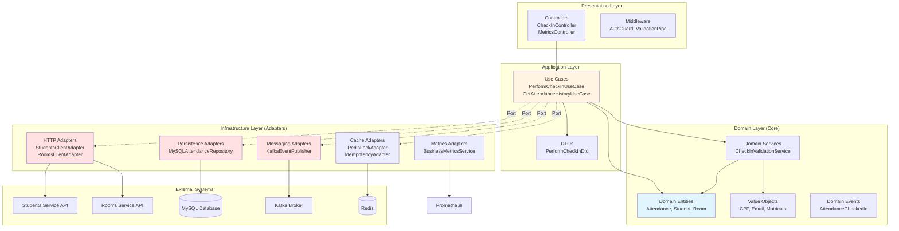

# 3. Arquitetura Hexagonal (Ports and Adapters)

```mermaid
graph TB
    subgraph "Domain Layer (Core)"
        Entities[Domain Entities<br/>Attendance, Student, Room]
        ValueObjects[Value Objects<br/>CPF, Email, Matricula]
        Services[Domain Services<br/>CheckInValidationService]
        Events[Domain Events<br/>AttendanceCheckedIn]
    end

    subgraph "Application Layer"
        UseCases[Use Cases<br/>PerformCheckInUseCase<br/>GetAttendanceHistoryUseCase]
        DTOs[DTOs<br/>PerformCheckInDto]
    end

    subgraph "Infrastructure Layer (Adapters)"
        HTTP[HTTP Adapters<br/>StudentsClientAdapter<br/>RoomsClientAdapter]
        Persistence[Persistence Adapters<br/>MySQLAttendanceRepository]
        Messaging[Messaging Adapters<br/>KafkaEventPublisher]
        Cache[Cache Adapters<br/>RedisLockAdapter<br/>IdempotencyAdapter]
        Metrics[Metrics Adapters<br/>BusinessMetricsService]
    end

    subgraph "Presentation Layer"
        Controllers[Controllers<br/>CheckInController<br/>MetricsController]
        Middleware[Middleware<br/>AuthGuard, ValidationPipe]
    end

    subgraph "External Systems"
        StudentsAPI[Students Service API]
        RoomsAPI[Rooms Service API]
        MySQL[(MySQL Database)]
        KafkaBroker[Kafka Broker]
        RedisInstance[(Redis)]
    end

    Controllers --> UseCases
    UseCases --> Services
    UseCases --> Entities
    UseCases --> DTOs
    Services --> Entities
    Services --> ValueObjects

    UseCases -.->|Port| HTTP
    UseCases -.->|Port| Persistence
    UseCases -.->|Port| Messaging
    UseCases -.->|Port| Cache

    HTTP --> StudentsAPI
    HTTP --> RoomsAPI
    Persistence --> MySQL
    Messaging --> KafkaBroker
    Cache --> RedisInstance
    Metrics --> Prometheus

    style Entities fill:#e1f5ff
    style UseCases fill:#fff4e1
    style HTTP fill:#ffe1e1
    style Persistence fill:#ffe1e1
    style Messaging fill:#ffe1e1
```

