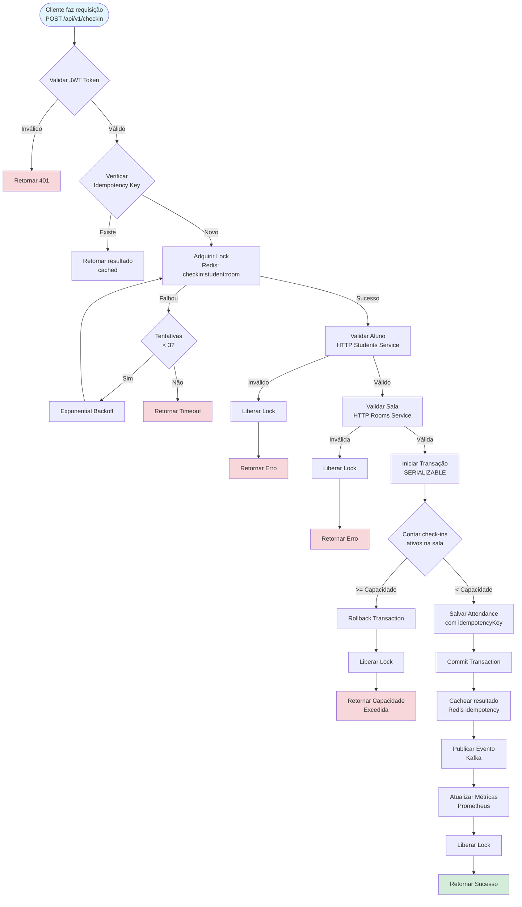

# 4. Fluxo de Check-in Detalhado

```mermaid
flowchart TD
    Start([Cliente faz requisição<br/>POST /api/v1/checkin]) --> ValidateJWT{Validar JWT Token}
    ValidateJWT -->|Inválido| Error1[Retornar 401]
    ValidateJWT -->|Válido| CheckIdempotency{Verificar<br/>Idempotency Key}
    
    CheckIdempotency -->|Existe| ReturnCached[Retornar resultado<br/>cached]
    CheckIdempotency -->|Novo| AcquireLock[Adquirir Lock<br/>Redis: checkin:student:room]
    
    AcquireLock -->|Falhou| RetryLock{Tentativas<br/>< 3?}
    RetryLock -->|Sim| Wait[Exponential Backoff]
    Wait --> AcquireLock
    RetryLock -->|Não| Error2[Retornar Timeout]
    
    AcquireLock -->|Sucesso| ValidateStudent[Validar Aluno<br/>HTTP Students Service]
    ValidateStudent -->|Inválido| ReleaseLock1[Liberar Lock]
    ReleaseLock1 --> Error3[Retornar Erro]
    
    ValidateStudent -->|Válido| ValidateRoom[Validar Sala<br/>HTTP Rooms Service]
    ValidateRoom -->|Inválida| ReleaseLock2[Liberar Lock]
    ReleaseLock2 --> Error4[Retornar Erro]
    
    ValidateRoom -->|Válida| StartTransaction[Iniciar Transação<br/>SERIALIZABLE]
    StartTransaction --> CheckCapacity{Contar check-ins<br/>ativos na sala}
    
    CheckCapacity -->|>= Capacidade| Rollback[Rollback Transaction]
    Rollback --> ReleaseLock3[Liberar Lock]
    ReleaseLock3 --> Error5[Retornar Capacidade<br/>Excedida]
    
    CheckCapacity -->|< Capacidade| SaveAttendance[Salvar Attendance<br/>com idempotencyKey]
    SaveAttendance --> Commit[Commit Transaction]
    Commit --> CacheResult[Cachear resultado<br/>Redis idempotency]
    CacheResult --> PublishEvent[Publicar Evento<br/>Kafka]
    PublishEvent --> UpdateMetrics[Atualizar Métricas<br/>Prometheus]
    UpdateMetrics --> ReleaseLock4[Liberar Lock]
    ReleaseLock4 --> Success[Retornar Sucesso]
    
    style Start fill:#e1f5ff
    style Success fill:#d4edda
    style Error1 fill:#f8d7da
    style Error2 fill:#f8d7da
    style Error3 fill:#f8d7da
    style Error4 fill:#f8d7da
    style Error5 fill:#f8d7da
```

