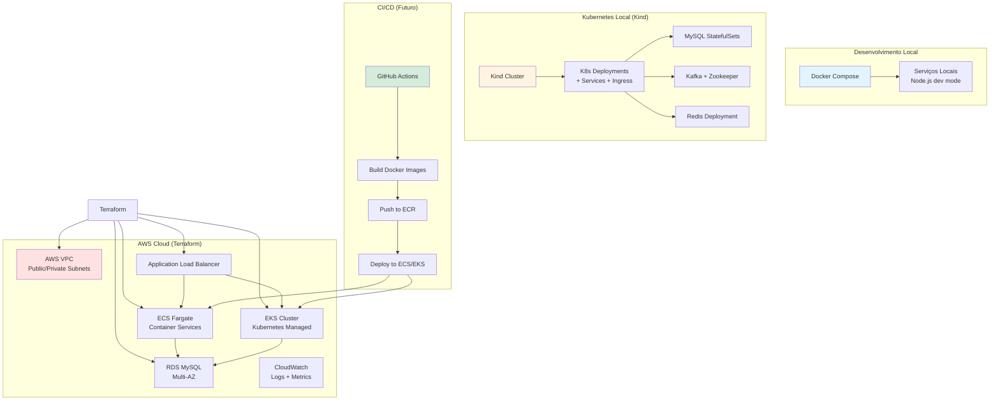

# 5. Infraestrutura e Deploy

```mermaid
graph TB
    subgraph "Desenvolvimento Local"
        DockerCompose[Docker Compose]
        LocalServices[Serviços Locais<br/>Node.js dev mode]
    end

    subgraph "Kubernetes Local (Kind)"
        K8sCluster[Kind Cluster]
        K8sServices[K8s Deployments<br/>+ Services + Ingress]
        K8sMySQL[MySQL StatefulSets]
        K8sKafka[Kafka + Zookeeper]
        K8sRedis[Redis Deployment]
    end

    subgraph "AWS Cloud (Terraform)"
        VPC[AWS VPC<br/>Public/Private Subnets]
        RDS[RDS MySQL<br/>Multi-AZ]
        ECS[ECS Fargate<br/>Container Services]
        EKS[EKS Cluster<br/>Kubernetes Managed]
        ALB[Application Load Balancer]
        CloudWatch[CloudWatch<br/>Logs + Metrics]
    end

    subgraph "CI/CD (Futuro)"
        GitHub[GitHub Actions]
        Build[Build Docker Images]
        Push[Push to ECR]
        Deploy[Deploy to ECS/EKS]
    end

    DockerCompose --> LocalServices
    K8sCluster --> K8sServices
    K8sServices --> K8sMySQL
    K8sServices --> K8sKafka
    K8sServices --> K8sRedis

    Terraform --> VPC
    Terraform --> RDS
    Terraform --> ECS
    Terraform --> EKS
    Terraform --> ALB

    ECS --> RDS
    EKS --> RDS
    ALB --> ECS
    ALB --> EKS

    GitHub --> Build
    Build --> Push
    Push --> Deploy
    Deploy --> ECS
    Deploy --> EKS

    style DockerCompose fill:#e1f5ff
    style K8sCluster fill:#fff4e1
    style VPC fill:#ffe1e1
    style GitHub fill:#d4edda
```

