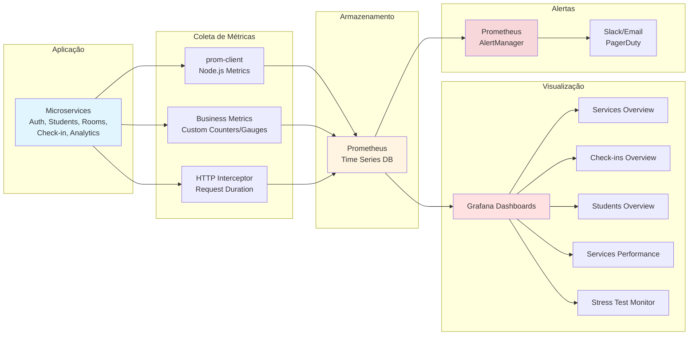

# 6. Observabilidade e Monitoramento

```mermaid
graph LR
    subgraph "Aplicação"
        Services[Microservices<br/>Auth, Students, Rooms,<br/>Check-in, Analytics]
    end

    subgraph "Coleta de Métricas"
        PromClient[prom-client<br/>Node.js Metrics]
        BusinessMetrics[Business Metrics<br/>Custom Counters/Gauges]
        HTTPInterceptor[HTTP Interceptor<br/>Request Duration]
    end

    subgraph "Armazenamento"
        Prometheus[Prometheus<br/>Time Series DB]
    end

    subgraph "Visualização"
        Grafana[Grafana Dashboards]
        Dashboard1[Services Overview]
        Dashboard2[Check-ins Overview]
        Dashboard3[Students Overview]
        Dashboard4[Services Performance]
        Dashboard5[Stress Test Monitor]
    end

    subgraph "Alertas"
        AlertManager[Prometheus<br/>AlertManager]
        Notifications[Slack/Email<br/>PagerDuty]
    end

    Services --> PromClient
    Services --> BusinessMetrics
    Services --> HTTPInterceptor

    PromClient --> Prometheus
    BusinessMetrics --> Prometheus
    HTTPInterceptor --> Prometheus

    Prometheus --> Grafana
    Grafana --> Dashboard1
    Grafana --> Dashboard2
    Grafana --> Dashboard3
    Grafana --> Dashboard4
    Grafana --> Dashboard5

    Prometheus --> AlertManager
    AlertManager --> Notifications

    style Services fill:#e1f5ff
    style Prometheus fill:#fff4e1
    style Grafana fill:#ffe1e1
    style AlertManager fill:#f8d7da
```

