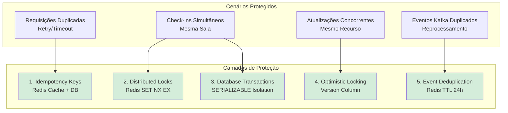

# 7. Proteções contra Race Conditions

```mermaid
graph TB
    subgraph "Camadas de Proteção"
        Layer1[1. Idempotency Keys<br/>Redis Cache + DB]
        Layer2[2. Distributed Locks<br/>Redis SET NX EX]
        Layer3[3. Database Transactions<br/>SERIALIZABLE Isolation]
        Layer4[4. Optimistic Locking<br/>Version Column]
        Layer5[5. Event Deduplication<br/>Redis TTL 24h]
    end

    subgraph "Cenários Protegidos"
        Scenario1[Requisições Duplicadas<br/>Retry/Timeout]
        Scenario2[Check-ins Simultâneos<br/>Mesma Sala]
        Scenario3[Atualizações Concorrentes<br/>Mesmo Recurso]
        Scenario4[Eventos Kafka Duplicados<br/>Reprocessamento]
    end

    Scenario1 --> Layer1
    Scenario2 --> Layer2
    Scenario2 --> Layer3
    Scenario3 --> Layer4
    Scenario4 --> Layer5

    style Layer1 fill:#d4edda
    style Layer2 fill:#d4edda
    style Layer3 fill:#d4edda
    style Layer4 fill:#d4edda
    style Layer5 fill:#d4edda
```

