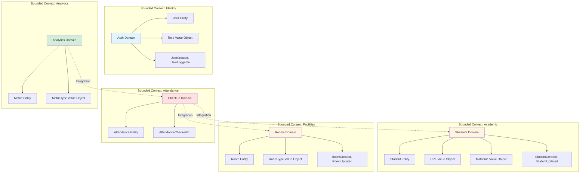

# 8. Estrutura de Domínios (DDD)

```mermaid
graph TB
    subgraph "Bounded Context: Identity"
        AuthDomain[Auth Domain]
        UserEntity[User Entity]
        RoleVO[Role Value Object]
        AuthEvents[UserCreated, UserLoggedIn]
    end

    subgraph "Bounded Context: Academic"
        StudentsDomain[Students Domain]
        StudentEntity[Student Entity]
        CPFVO[CPF Value Object]
        MatriculaVO[Matricula Value Object]
        StudentEvents[StudentCreated, StudentUpdated]
    end

    subgraph "Bounded Context: Facilities"
        RoomsDomain[Rooms Domain]
        RoomEntity[Room Entity]
        RoomTypeVO[RoomType Value Object]
        RoomEvents[RoomCreated, RoomUpdated]
    end

    subgraph "Bounded Context: Attendance"
        CheckinDomain[Check-in Domain]
        AttendanceEntity[Attendance Entity]
        CheckinEvents[AttendanceCheckedIn]
    end

    subgraph "Bounded Context: Analytics"
        AnalyticsDomain[Analytics Domain]
        MetricEntity[Metric Entity]
        MetricTypeVO[MetricType Value Object]
    end

    AuthDomain --> UserEntity
    AuthDomain --> RoleVO
    AuthDomain --> AuthEvents

    StudentsDomain --> StudentEntity
    StudentsDomain --> CPFVO
    StudentsDomain --> MatriculaVO
    StudentsDomain --> StudentEvents

    RoomsDomain --> RoomEntity
    RoomsDomain --> RoomTypeVO
    RoomsDomain --> RoomEvents

    CheckinDomain --> AttendanceEntity
    CheckinDomain --> CheckinEvents

    AnalyticsDomain --> MetricEntity
    AnalyticsDomain --> MetricTypeVO

    CheckinDomain -.->|Integration| StudentsDomain
    CheckinDomain -.->|Integration| RoomsDomain
    AnalyticsDomain -.->|Integration| CheckinDomain

    style AuthDomain fill:#e1f5ff
    style StudentsDomain fill:#fff4e1
    style RoomsDomain fill:#fff4e1
    style CheckinDomain fill:#ffe1e1
    style AnalyticsDomain fill:#d4edda
```

