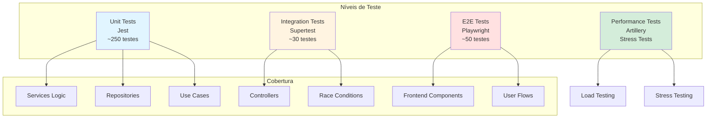

# 9. Fluxo de Testes

```mermaid
graph TB
    subgraph "Níveis de Teste"
        Unit[Unit Tests<br/>Jest<br/>~250 testes]
        Integration[Integration Tests<br/>Supertest<br/>~30 testes]
        E2E[E2E Tests<br/>Playwright<br/>~50 testes]
        Performance[Performance Tests<br/>Artillery<br/>Stress Tests]
    end

    subgraph "Cobertura"
        Services[Services Logic]
        Repositories[Repositories]
        UseCases[Use Cases]
        Controllers[Controllers]
        Frontend[Frontend Components]
        Flows[User Flows]
        RaceConditions[Race Conditions]
    end

    Unit --> Services
    Unit --> Repositories
    Unit --> UseCases

    Integration --> Controllers
    Integration --> RaceConditions

    E2E --> Frontend
    E2E --> Flows

    Performance --> Load[Load Testing]
    Performance --> Stress[Stress Testing]

    style Unit fill:#e1f5ff
    style Integration fill:#fff4e1
    style E2E fill:#ffe1e1
    style Performance fill:#d4edda
```

