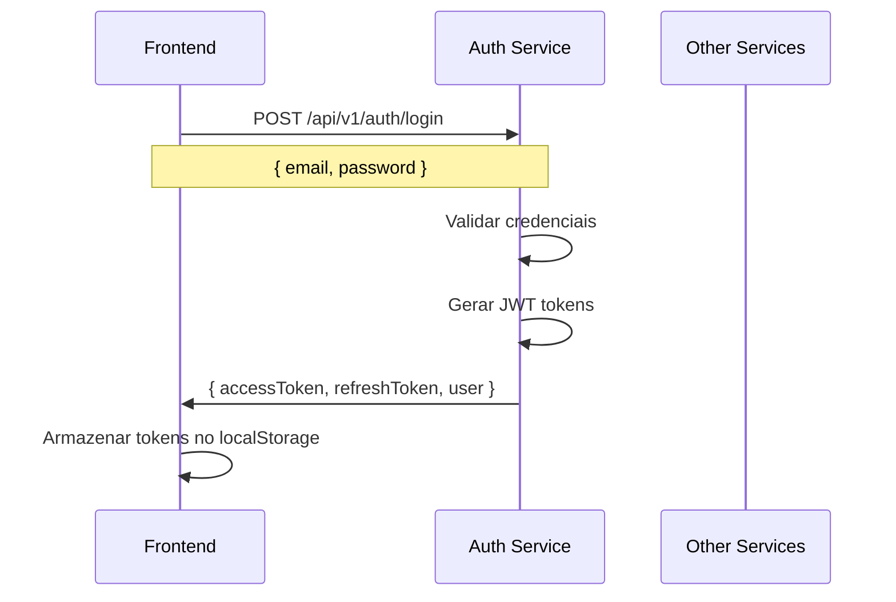
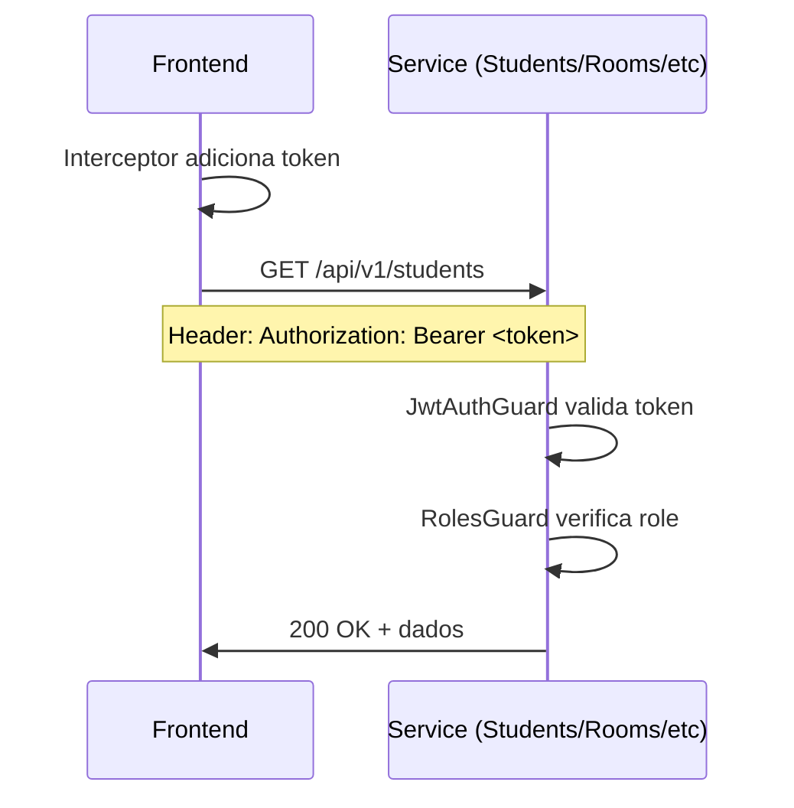
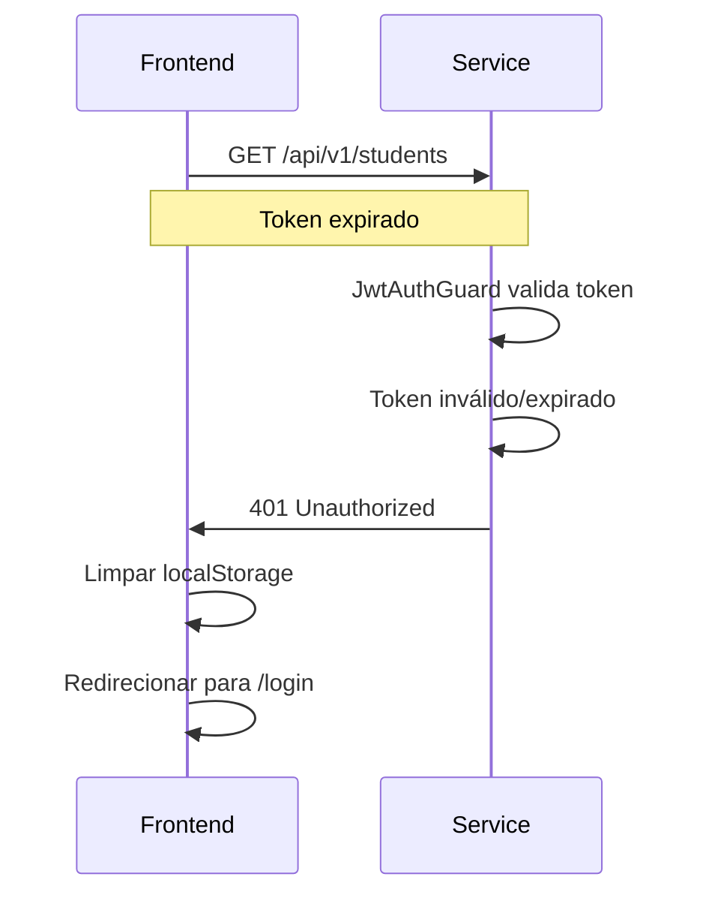

# 🔐 Guia de Autenticação JWT

Documentação completa sobre o sistema de autenticação e autorização do projeto.

## 📋 Índice

- [Visão Geral](#visão-geral)
- [Arquitetura de Autenticação](#arquitetura-de-autenticação)
- [Backend - Como Funciona](#backend---como-funciona)
- [Frontend - Como Funciona](#frontend---como-funciona)
- [Fluxo Completo](#fluxo-completo)
- [Configuração](#configuração)
- [Uso Prático](#uso-prático)
- [Troubleshooting](#troubleshooting)

## 🎯 Visão Geral

O sistema utiliza **JWT (JSON Web Tokens)** para autenticação e autorização baseada em roles (RBAC).

### Características

- ✅ **Stateless**: Tokens JWT não requerem armazenamento no servidor
- ✅ **Distribuído**: Cada serviço valida tokens independentemente
- ✅ **Seguro**: Tokens assinados com secret compartilhado
- ✅ **Roles**: Controle de acesso baseado em roles (ADMIN, STUDENT, MONITOR)
- ✅ **Refresh Tokens**: Renovação automática de tokens

### Componentes

1. **Auth Service** (Porta 3000) - Gera tokens JWT
2. **Outros Serviços** (3001-3004) - Validam tokens JWT
3. **Frontend Admin** (Porta 5173) - Interface administrativa
4. **Frontend Student** (Porta 5174) - Interface do estudante

## 🏗️ Arquitetura de Autenticação

### Fluxo de Autenticação

```
┌─────────────┐
│   Frontend  │
│  (Admin/    │
│  Student)   │
└──────┬──────┘
       │ 1. POST /api/v1/auth/login
       │    { email, password }
       ▼
┌─────────────┐
│ Auth Service│
│  (Port 3000) │
└──────┬──────┘
       │ 2. Retorna { accessToken, refreshToken, user }
       ▼
┌─────────────┐
│   Frontend  │
│  (Armazena  │
│   token)    │
└──────┬──────┘
       │ 3. Requisições com Authorization: Bearer <token>
       ▼
┌─────────────────────────────────────────┐
│  Students │ Rooms │ Check-in │ Analytics│
│  (3001)   │ (3002)│  (3003)  │  (3004)  │
│           │       │          │          │
│  JwtAuthGuard valida token usando      │
│  JWT_SECRET compartilhado              │
└─────────────────────────────────────────┘
```

### Decisão Arquitetural

**Opção Escolhida**: Cada serviço valida tokens independentemente usando o mesmo `JWT_SECRET`.

**Vantagens:**
- ✅ Sem acoplamento entre serviços
- ✅ Cada serviço é independente
- ✅ Fácil manutenção
- ✅ Alinhado com padrão JWT stateless

**Como Funciona:**
1. Auth Service gera tokens usando `JWT_SECRET`
2. Outros serviços validam tokens usando o mesmo `JWT_SECRET`
3. Não há comunicação entre serviços para validar tokens

## 🔧 Backend - Como Funciona

### Auth Service (Gerador de Tokens)

**Localização**: `services/auth-service/`

**Responsabilidades:**
- Gerar access tokens e refresh tokens
- Validar credenciais de login
- Registrar novos usuários

**Endpoints:**
- `POST /api/v1/auth/login` - Autenticar usuário
- `POST /api/v1/auth/register` - Registrar novo usuário
- `GET /api/v1/auth/validate` - Validar token (para API Gateway)

**Estrutura do Token JWT:**
```json
{
  "sub": "user-id",
  "email": "user@example.com",
  "role": "ADMIN",
  "iat": 1234567890,
  "exp": 1234571490
}
```

**Configuração:**
```env
JWT_SECRET=seu-jwt-secret-aqui
JWT_EXPIRES_IN=1h
JWT_REFRESH_EXPIRES_IN=7d
```

### Outros Serviços (Validadores de Tokens)

**Serviços que validam tokens:**
- Students Service (Porta 3001)
- Rooms Service (Porta 3002)
- Check-in Service (Porta 3003)
- Analytics Service (Porta 3004)

**Componentes Implementados:**

1. **JwtAuthGuard** (`src/presentation/http/guards/jwt-auth.guard.ts`)
   - Extrai token do header `Authorization: Bearer <token>`
   - Valida token usando `JWT_SECRET`
   - Adiciona payload ao `request.user`

2. **RolesGuard** (`src/presentation/http/guards/roles.guard.ts`)
   - Verifica se usuário tem role necessária
   - Usa decorator `@Roles()` para definir roles permitidas

3. **@Roles() Decorator** (`src/presentation/http/decorators/roles.decorator.ts`)
   - Define roles permitidas para endpoints

**Exemplo de Uso:**
```typescript
@Controller('students')
@UseGuards(JwtAuthGuard, RolesGuard)
@ApiBearerAuth()
export class StudentsController {
  @Post()
  @Roles('ADMIN')
  async create(@Body() dto: CreateStudentDto) {
    // Apenas ADMIN pode criar alunos
  }

  @Get()
  @Roles('ADMIN', 'MONITOR')
  async findAll() {
    // ADMIN e MONITOR podem listar alunos
  }
}
```

**Configuração Necessária:**
```env
JWT_SECRET=mesmo-secret-do-auth-service
JWT_EXPIRES_IN=1h
```

**Importante**: Todos os serviços devem usar o **mesmo** `JWT_SECRET` que o Auth Service.

## 🎨 Frontend - Como Funciona

### Admin Frontend

**Localização**: `frontend/admin/`

**Componentes de Autenticação:**

1. **Auth Service** (`src/services/auth.service.ts`)
   - Gerencia login, register, logout
   - Armazena tokens no localStorage
   - Fornece métodos para verificar autenticação

2. **Auth Store** (`src/stores/auth.store.ts`)
   - Estado global de autenticação (Zustand)
   - Métodos: `login()`, `logout()`, `initialize()`

3. **Login Page** (`src/pages/Login.tsx`)
   - Formulário de login
   - Redireciona para dashboard após login

4. **ProtectedRoute** (`src/components/ProtectedRoute.tsx`)
   - Componente que protege rotas
   - Redireciona para `/login` se não autenticado

5. **API Interceptor** (`src/services/api.ts`)
   - Adiciona token automaticamente em todas as requisições
   - Trata erro 401 (redireciona para login)

**Fluxo:**
```typescript
// 1. Login
const { login } = useAuthStore();
await login({ email, password });

// 2. Token é armazenado automaticamente no localStorage
// 3. Interceptor adiciona token em todas as requisições
// 4. Se token expirar (401), redireciona para login
```

### Student Frontend

**Localização**: `frontend/student/`

**Componentes de Autenticação:**

1. **Auth Service** (`src/services/auth.service.ts`) - Mesmo padrão do admin
2. **Auth Store** (`src/stores/auth.store.ts`) - Mesmo padrão do admin
3. **Login Page** (`src/pages/Login.tsx`) - Formulário de login
4. **ProtectedRoute** (`src/components/ProtectedRoute.tsx`) - Protege rotas
5. **Interceptors** - `checkin.service.ts` e `rooms.service.ts` incluem token

**Fluxo:**
```typescript
// 1. Login
const { login } = useAuthStore();
await login({ email, password });

// 2. Token é armazenado automaticamente
// 3. Interceptors adicionam token nas requisições
// 4. Rotas protegidas redirecionam para login se não autenticado
```

## 🔄 Fluxo Completo

### 1. Login



### 2. Requisição Autenticada



### 3. Token Expirado



## ⚙️ Configuração

### Backend - Auth Service

**Arquivo**: `services/auth-service/.env.local`

```env
JWT_SECRET=seu-jwt-secret-aqui-mude-em-producao
JWT_EXPIRES_IN=1h
JWT_REFRESH_EXPIRES_IN=7d
```

### Backend - Outros Serviços

**Arquivos**: `services/*-service/.env.local`

```env
JWT_SECRET=mesmo-secret-do-auth-service
JWT_EXPIRES_IN=1h
```

**Importante**: Todos os serviços devem usar o **mesmo** `JWT_SECRET`.

### Frontend

**Admin Frontend**: `frontend/admin/.env.local` (opcional)
```env
VITE_API_BASE_URL=http://localhost:3000/api/v1
```

**Student Frontend**: `frontend/student/.env.local` (opcional)
```env
VITE_API_BASE_URL=http://localhost:3000/api/v1
```

## 💻 Uso Prático

### Backend - Proteger Endpoint

```typescript
import { Controller, Post, UseGuards } from '@nestjs/common';
import { JwtAuthGuard } from '../guards/jwt-auth.guard';
import { RolesGuard } from '../guards/roles.guard';
import { Roles } from '../decorators/roles.decorator';

@Controller('students')
@UseGuards(JwtAuthGuard, RolesGuard)
@ApiBearerAuth()
export class StudentsController {
  @Post()
  @Roles('ADMIN')
  async create(@Body() dto: CreateStudentDto) {
    // Apenas ADMIN pode criar
  }

  @Get()
  @Roles('ADMIN', 'MONITOR')
  async findAll() {
    // ADMIN e MONITOR podem listar
  }
}
```

### Backend - Acessar Usuário Autenticado

```typescript
@Get(':id')
@Roles('ADMIN', 'MONITOR', 'STUDENT')
async findOne(@Param('id') id: string, @Req() req: Request) {
  const user = req.user; // { sub, email, role }
  
  // STUDENT só pode ver próprio perfil
  if (user.role === 'STUDENT' && user.sub !== id) {
    throw new ForbiddenException('Acesso negado');
  }
  
  return this.service.findOne(id);
}
```

### Frontend - Login

```typescript
import { useAuthStore } from '@/stores/auth.store';

function LoginPage() {
  const { login, loading, error } = useAuthStore();
  
  const handleSubmit = async (e: React.FormEvent) => {
    e.preventDefault();
    try {
      await login({ email, password });
      navigate('/dashboard');
    } catch (err) {
      // Error já está no store
    }
  };
  
  return (
    <form onSubmit={handleSubmit}>
      {/* Form fields */}
    </form>
  );
}
```

### Frontend - Fazer Requisição Autenticada

```typescript
import { api } from '@/services/api';

// Token é adicionado automaticamente pelo interceptor
const response = await api.get('/students');
```

### Frontend - Verificar Autenticação

```typescript
import { useAuthStore } from '@/stores/auth.store';

function MyComponent() {
  const { isAuthenticated, user } = useAuthStore();
  
  if (!isAuthenticated) {
    return <Navigate to="/login" />;
  }
  
  return <div>Olá, {user?.email}</div>;
}
```

### Frontend - Logout

```typescript
import { useAuthStore } from '@/stores/auth.store';

function LogoutButton() {
  const { logout } = useAuthStore();
  
  const handleLogout = () => {
    logout();
    navigate('/login');
  };
  
  return <button onClick={handleLogout}>Sair</button>;
}
```

## 🔍 Troubleshooting

### Problema: Token inválido ou expirado

**Sintomas:**
- Erro 401 em todas as requisições
- Redirecionamento constante para login

**Soluções:**
1. Verificar se `JWT_SECRET` é o mesmo em todos os serviços
2. Verificar se token não expirou (padrão: 1 hora)
3. Fazer login novamente

### Problema: Frontend não envia token

**Sintomas:**
- Requisições retornam 401
- Token não aparece no header Authorization

**Soluções:**
1. Verificar se token está no localStorage: `localStorage.getItem('auth_token')`
2. Verificar se interceptor está configurado corretamente
3. Verificar se Auth Store está inicializado: `useAuthStore.getState().initialize()`

### Problema: Role não autorizada

**Sintomas:**
- Erro 403 Forbidden
- Mensagem "Acesso negado"

**Soluções:**
1. Verificar se usuário tem role necessária
2. Verificar se `@Roles()` decorator está correto
3. Verificar se `RolesGuard` está aplicado

### Problema: Token não é validado

**Sintomas:**
- Erro 401 mesmo com token válido
- Mensagem "Token inválido ou expirado"

**Soluções:**
1. Verificar se `JWT_SECRET` é o mesmo em todos os serviços
2. Verificar se token está no formato correto: `Bearer <token>`
3. Verificar logs do serviço para mais detalhes

## 📊 Matriz de Permissões

| Endpoint | ADMIN | MONITOR | STUDENT |
|----------|-------|---------|---------|
| **Students Service** |
| POST /students | ✅ | ❌ | ❌ |
| GET /students | ✅ | ✅ | ❌ |
| GET /students/:id | ✅ | ✅ | ✅ (próprio) |
| PUT /students/:id | ✅ | ❌ | ❌ |
| DELETE /students/:id | ✅ | ❌ | ❌ |
| **Rooms Service** |
| POST /rooms | ✅ | ❌ | ❌ |
| GET /rooms | ✅ | ✅ | ✅ |
| GET /rooms/:id | ✅ | ✅ | ✅ |
| PUT /rooms/:id | ✅ | ❌ | ❌ |
| DELETE /rooms/:id | ✅ | ❌ | ❌ |
| **Check-in Service** |
| POST /checkin | ✅ | ❌ | ✅ |
| GET /checkin/history/:studentId | ✅ | ✅ | ✅ (próprio) |
| GET /checkin/active | ✅ | ✅ | ✅ |
| POST /checkin/checkout | ✅ | ❌ | ✅ |
| **Analytics Service** |
| GET /analytics/dashboard | ✅ | ✅ | ❌ |
| GET /analytics/rooms/stats | ✅ | ✅ | ❌ |
| GET /analytics/students/:studentId/stats | ✅ | ✅ | ✅ (próprio) |

## 🔐 Segurança

### Boas Práticas

1. **Nunca** expor `JWT_SECRET` em código
2. **Sempre** usar HTTPS em produção
3. **Validar** tokens em todos os endpoints protegidos
4. **Não** confiar apenas no frontend para autorização
5. **Implementar** rate limiting (futuro)
6. **Armazenar** tokens de forma segura (localStorage é aceitável para este projeto)

### Limitações Conhecidas

- ⚠️ Refresh token automático não implementado no frontend
- ⚠️ Rate limiting não implementado
- ⚠️ CSRF tokens não implementados
- ⚠️ Tokens armazenados em localStorage (vulnerável a XSS)

### Recomendações para Produção

1. Implementar refresh token automático
2. Usar HttpOnly cookies para tokens
3. Implementar rate limiting
4. Adicionar validação de CSRF
5. Implementar revogação de tokens
6. Adicionar logging de tentativas de acesso

## 📚 Recursos Adicionais

- [Plano de Autenticação JWT](../docs_ia/PLANO_AUTENTICACAO_JWT.md) - Plano detalhado de implementação
- [Política de Segurança](./SECURITY.md) - Política geral de segurança
- [Documentação de APIs](../api/API_DOCUMENTATION.md) - Documentação completa das APIs

---

**Última atualização**: 2025-01-24

